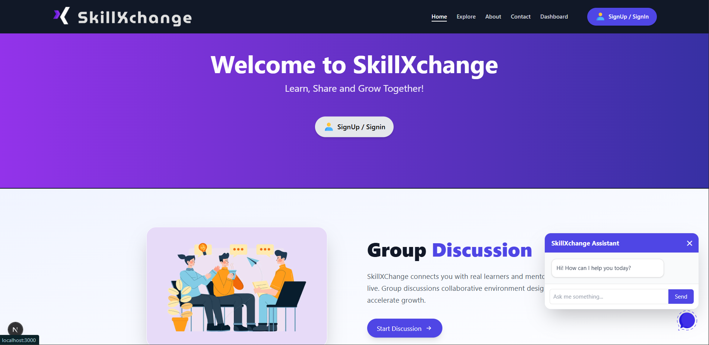

# 🚀 SkillXchange

SkillXchange is a modern platform to connect learners and experts, enabling seamless skill exchange and collaboration. Built with Next.js, Firebase, and Tailwind CSS, it offers real-time chat, video calls, and role-based profiles for an engaging learning experience.




## 🌟 Features

- 👥 User registration & login with Firebase Authentication  
- 🎭 Role selection: Learner or Expert  
- 💬 Real-time chat powered by GetStream  
- 📹 Video calls integrated via ZEGOCLOUD  
- 📝 User profiles with editable details and skill listings  
- ⭐ Review system for learners to rate experts  
- 📱 Fully responsive and mobile-friendly design  

## 🛠 Tech Stack

- **Framework:** Next.js  
- **Authentication & Database:** Firebase (Firestore)  
- **Chat:** GetStream  
- **Video Calls:** ZEGOCLOUD  
- **Styling:** Tailwind CSS  
- **State Management:** React Hooks  


## 📦 Installation

Follow these steps to run SkillXchange locally:

# 1. Clone the repo
```bash
git clone https://github.com/mr-coder-raj/SkillXchange.git
```

# 2. Navigate into the folder
```
cd SkillXchange
```
# 3. Install dependencies
```
npm install
```
# 4. Create a `.env.local` file and add your config keys:

NEXT_PUBLIC_CLERK_PUBLISHABLE_KEY=your_clerk_publishable_key_here  
CLERK_SECRET_KEY=your_clerk_secret_key_here

# 5. Run the development server
```
npm run dev
```

## Open your browser and visit:
👉 http://localhost:3000
